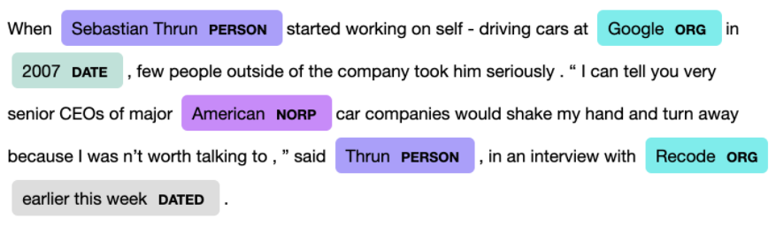

# NLP-NAMED-ENTITY-RECOGNITION-PROJECT-TILL-DEPLOYMENT
This is one of the Natural Language Processing project. In this project we are going to highlight the entities which are we get after extracting the text with the help of web scraping. 

# Web-App URL:

https://named-entity-recognition-proj.herokuapp.com/

# What Is Named Entity Recognition:
Named Entity Recognition <b>(NER)</b> seeks to locate & classify named entities mentioned in unstructured text pre-defined categories such as...
- Person             (PERSON)
- Organization       (ORG) 
- Location           (GPE) 
- Date               (DATE)
- Money              (MONEY)   
- Product            (PRODUCT)
...etc.

All of the above mentioned categories are highligted with some color which is completely different for all the entities and beside that entity it's category is written.

Example:

# Technologies Used:

- Python
- PyCharm
- HTML/CSS/JS
- Spacy
- Flask
- Wikipedia
- HeroKu

# Working Mechanish Of This Project:

At first I imported all the essential libraries such as spacy, Flask, wikipedia...etc. Then I started to create a basic Flask model.
After that at home function I took the subject that the user is interstead in. Then I passed it to the Prediction function in which with the help of wikipedia library I started to web scraping for the subject which user is interestead in. After the web scraping is over I gave that scraped data to the scpacy which which will give me the final output as I had show above in the form of NER.

# Reference:

- https://flask-doc.readthedocs.io/en/latest/
- https://spacy.io/api/doc/
- https://devcenter.heroku.com/categories/reference
