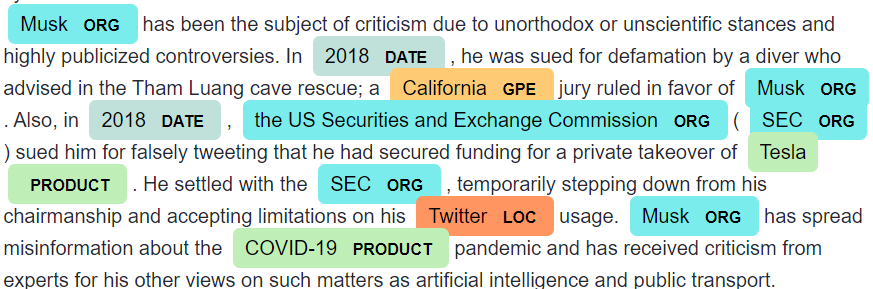

# NLP-NAMED-ENTITY-RECOGNITION-PROJECT-TILL-DEPLOYMENT
This is one of the Natural Language Processing project. In this project we are going to highlight the entities which are we get after extracting the text with the help of web scraping. 

# What Is Named Entity Recognition
Named Entity Recognition <b>(NER)</b> seeks to locate & classify named entities mentioned in unstructured text pre-defined categories such as...
- Person             (PERSON)
- Organization       (ORG) 
- Location           (GPE) 
- Date               (DATE)
- Money              (MONEY)   
- Product            (PRODUCT)
...etc.

All of the above mentioned categories are highligted with some color which is completely different for all the entities and beside that entity it's category is written.

Example:

